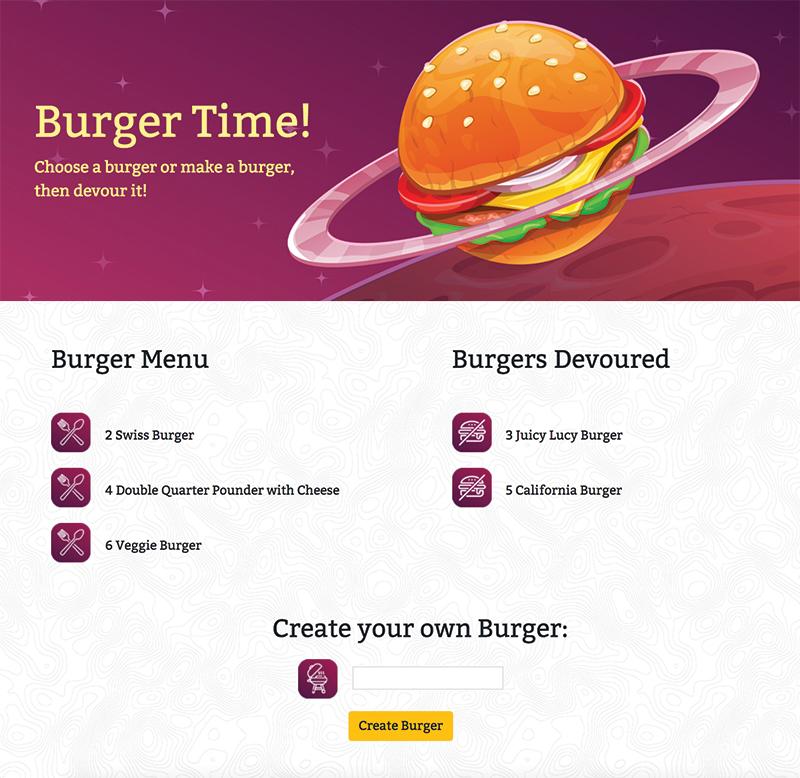

# burger
Burger logger with MySQL, Node, Express, Handlebars and a homemade ORM. Node and MySQL to query and route app data, and Handlebars to generate the HTML.

## Apps ##

**Burger Time**

[Video Full Project](https://damp-brook-51006.herokuapp.com/)

## Tools ##

**Technology Used**
* Node.js
* Javascript
* mySQL
* Express.js
* Heroku
* Handlebars
* JawsDB
* Path
* Body-parser

